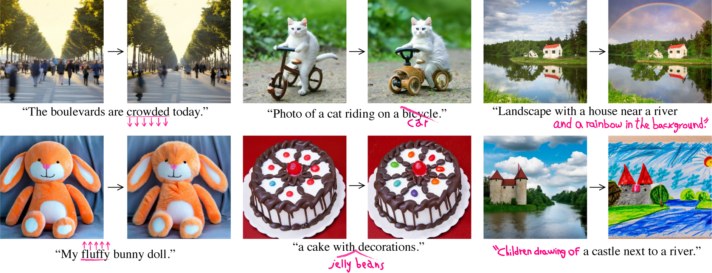

# Prompt-to-Prompt: An efficient implementation


### [Project Page](https://prompt-to-prompt.github.io)&ensp;&ensp;&ensp;[Paper](https://prompt-to-prompt.github.io/ptp_files/Prompt-to-Prompt_preprint.pdf)


## Original repo

https://github.com/google/prompt-to-prompt

## How is this repo different from the paper?
* The original version requires saving attention weights, this version only requires providing 2 text embedding for the model, one for the key and one for the value in the attention.
  * This allows for a much simpler implementation, and also allows for optimization using memory efficient attention.
  * The only change needed is here: https://github.com/cccntu/diffusers/commit/b43bc04e211f1439ca9bcf47966c17bd43ae310b
* Another difference is how the replacement is done. In the paper, the replacement is done by replacing the key and value of the attention. In this version, the replacement is done by replacing the value of the attention.
  * This allows for a much simpler implementation, and also allows for optimization using memory efficient attention.

## Usage

* install the version of diffusers, or change it in your own version of diffusers
```
pip install git+https://github.com/cccntu/diffusers@b43bc04e2
```

## Disclaimer

* not all features are implemented.


## Citation

```
@article{hertz2022prompt,
  title={Prompt-to-Prompt Image Editing with Cross Attention Control},
  author={Hertz, Amir and Mokady, Ron and Tenenbaum, Jay and Aberman, Kfir and Pritch, Yael and Cohen-Or, Daniel},
  journal={arXiv preprint arXiv:2208.01626},
  year={2022}
}
```
